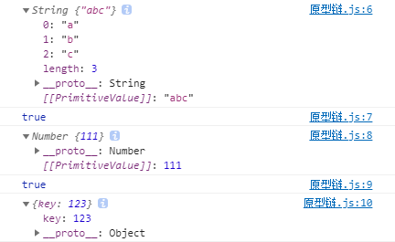

## 1、原型

​		在JavaScript中，其实只有对象，没有类的概念。不要被ES6的class关键字给蒙骗了。JavaScript实际上是**基于原型的面向对象语言**。那么什么是原型呢？


​		先来看一个小demo：

```javascript
var a = new String("abc")
var b = new Number(111)
var c = new Object({
  key:123,
})
console.log(a);
console.log(a.__proto__===String.prototype);	// true
console.log(b);
console.log(b.__proto__===Number.prototype);	// true
console.log(c);
```



​		`__proto__`实际上就是我们变量a，b，c的原型，它们都各有所指，在接下来的部分，我们将会详细阐述它们的指向。


### 1.1 原型对象

​		每当我们使用面向对象思想编程的时候，会把一个对象先抽成一个类，但是JavaScript中实际上没有类的概念，正如上面所说，它是一门基于原型的面向对象的语言。

​		考虑一下代码：

```javascript
function Person(name,age){
  this.name = name;
  this.age = age;
}

Person.prototype.greet = function(){
  alert("Hi, my name is "+this.name+", I am "+this.age+" years old!")
}
var person = new Person("garfield",18);
person.greet();
```

		

​		我们创建的每个函数都有一个 prototype （原型）属性，这个属性是一个指针，指向一个原型对象，而这个原型对象中拥有的属性和方法可以被实例共享。


### 1.2 理解原型对象

​		无论什么时候，只要创建一个新函数，就会根据一组特定的规则为该函数创建一个prototype属性。这个属性指向函数的对象原型。

​		在默认情况下，所有原型对象都会自动获得一个constructor函数（属性），这个属性包含一个指向prototype属性所在函数的指针。

​		用一张图来形象的表明：


我们可以通过代码来进行验证，我们可以在控制台输出结果为true。

```javascript
// 在上面的代码中添加下面这一行
console.log(person.__proto__ === Person.prototype);		// true
```

### 1.3 __proto__深入

​		在第一个例子里面可以发现`__proto__`还是一个对象，我们点开其实发现里面还有一个`__proto__`（除了第三个`__proto__`是Object）。而最深层的`__proto__`均为Object。我们可以大胆猜测实际上所有的类型的原型都是Object。而这个猜测是正确的，在后面原型链中会给出解释。


### 1.4 JavaScript new一个对象的过程

直接上代码：

```javascript
function Mother(lastName){
    this.lastName = lastName;
}
var son = new Mother("Da");
```

这短短几行代码发生了什么呢？

1. 创建了一个新的对象 *son*。
2. 新对象会被执行[[prototype]]连接。具体可以理解为`son.__proto__=Mother.prototype`。
3. 新对象和函数调用的this会绑定起来。 具体可以理解为`Mother.call(son,"Da")`。
4. 执行狗在函数中的代码。具体可以理解为给son添加了新属性`lastname`。
5. 自动返回这个新对象。


## 2、原型链